* Table of Contents
{:toc}

--------------------------------------------------------------------------------------------------------------------

## **Acknowledgements**

* {list here sources of all reused/adapted ideas, code, documentation, and third-party libraries -- include links to the original source as well}

--------------------------------------------------------------------------------------------------------------------

## **Setting up, getting started**

Refer to the guide [_Setting up and getting started_](SettingUp.md).

--------------------------------------------------------------------------------------------------------------------

## **Design**

:bulb: **Tip:** The `.puml` files used to create diagrams in this document `docs/diagrams` folder. Refer to the [_PlantUML Tutorial_ at se-edu/guides](https://se-education.org/guides/tutorials/plantUml.html) to learn how to create and edit diagrams.

### Architecture

The ***Architecture Diagram*** given above explains the high-level design of the App.

Given below is a quick overview of main components and how they interact with each other.

**Main components of the architecture**

**`Main`** (consisting of classes [`Main`](https://github.com/se-edu/addressbook-level3/tree/master/src/main/java/seedu/address/Main.java) and [`MainApp`](https://github.com/se-edu/addressbook-level3/tree/master/src/main/java/seedu/address/MainApp.java)) is in charge of the app launch and shut down.
* At app launch, it initializes the other components in the correct sequence, and connects them up with each other.
* At shut down, it shuts down the other components and invokes cleanup methods where necessary.

The bulk of the app's work is done by the following four components:

* [**`UI`**](#ui-component): The UI of the App.
* [**`Logic`**](#logic-component): The command executor.
* [**`Model`**](#model-component): Holds the data of the App in memory.
* [**`Storage`**](#storage-component): Reads data from, and writes data to, the hard disk.

[**`Commons`**](#common-classes) represents a collection of classes used by multiple other components.

**How the architecture components interact with each other**

The *Sequence Diagram* below shows how the components interact with each other for the scenario where the user issues the command `delete 1`.

Each of the four main components (also shown in the diagram above),

* defines its *API* in an `interface` with the same name as the Component.
* implements its functionality using a concrete `{Component Name}Manager` class (which follows the corresponding API `interface` mentioned in the previous point.

For example, the `Logic` component defines its API in the `Logic.java` interface and implements its functionality using the `LogicManager.java` class which follows the `Logic` interface. Other components interact with a given component through its interface rather than the concrete class (reason: to prevent outside component's being coupled to the implementation of a component), as illustrated in the (partial) class diagram below.

The sections below give more details of each component.

### UI component

The **API** of this component is specified in [`Ui.java`](https://github.com/se-edu/addressbook-level3/tree/master/src/main/java/seedu/address/ui/Ui.java)

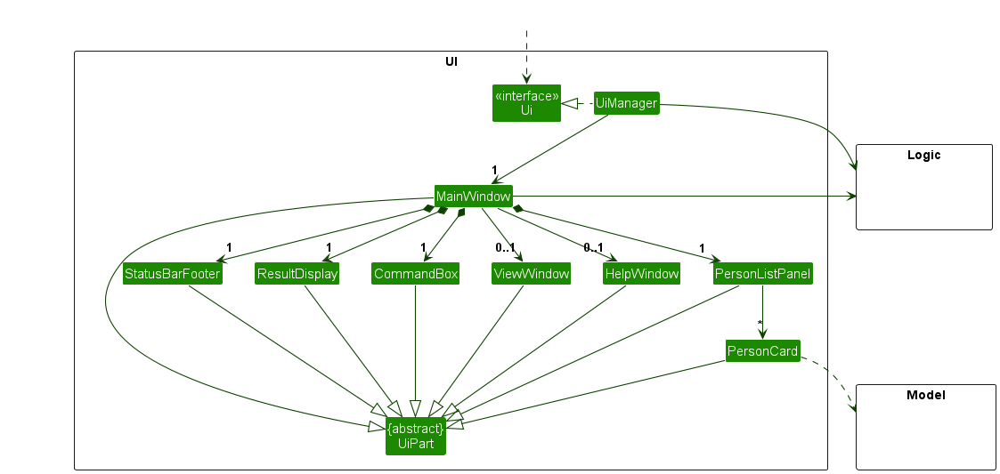

The UI consists of a `MainWindow` that is made up of parts e.g.`CommandBox`, `ResultDisplay`, `PersonListPanel`, `StatusBarFooter` `HelpWindow` `ViewWindow` etc. All these, including the `MainWindow`, inherit from the abstract `UiPart` class which captures the commonalities between classes that represent parts of the visible GUI.

The `UI` component uses the JavaFx UI framework. The layout of these UI parts are defined in matching `.fxml` files that are in the `src/main/resources/view` folder. For example, the layout of the [`MainWindow`](https://github.com/se-edu/addressbook-level3/tree/master/src/main/java/seedu/address/ui/MainWindow.java) is specified in [`MainWindow.fxml`](https://github.com/se-edu/addressbook-level3/tree/master/src/main/resources/view/MainWindow.fxml)

The `UI` component,

* executes user commands using the `Logic` component.
* listens for changes to `Model` data so that the UI can be updated with the modified data.
* keeps a reference to the `Logic` component, because the `UI` relies on the `Logic` to execute commands.
* depends on some classes in the `Model` component, as it displays `Person` object residing in the `Model`.

### Logic component

**API** : [`Logic.java`](https://github.com/se-edu/addressbook-level3/tree/master/src/main/java/seedu/address/logic/Logic.java)

Here's a (partial) class diagram of the `Logic` component:

The sequence diagram below illustrates the interactions within the `Logic` component, taking `execute("delete 1")` API call as an example.

:information_source: **Note:** The lifeline for `DeleteCommandParser` should end at the destroy marker (X) but due to a limitation of PlantUML, the lifeline continues till the end of diagram.

How the `Logic` component works:

1. When `Logic` is called upon to execute a command, it is passed to an `AddressBookParser` object which in turn creates a parser that matches the command (e.g., `DeleteCommandParser`) and uses it to parse the command.
1. This results in a `Command` object (more precisely, an object of one of its subclasses e.g., `DeleteCommand`) which is executed by the `LogicManager`.
1. The command can communicate with the `Model` when it is executed (e.g. to delete a person). 
   Note that although this is shown as a single step in the diagram above (for simplicity), in the code it can take several interactions (between the command object and the `Model`) to achieve.
1. The result of the command execution is encapsulated as a `CommandResult` object which is returned back from `Logic`.

Here are the other classes in `Logic` (omitted from the class diagram above) that are used for parsing a user command:

How the parsing works:
* When called upon to parse a user command, the `AddressBookParser` class creates an `XYZCommandParser` (`XYZ` is a placeholder for the specific command name e.g., `AddCommandParser`) which uses the other classes shown above to parse the user command and create a `XYZCommand` object (e.g., `AddCommand`) which the `AddressBookParser` returns back as a `Command` object.
* All `XYZCommandParser` classes (e.g., `AddCommandParser`, `DeleteCommandParser`, ...) inherit from the `Parser` interface so that they can be treated similarly where possible e.g, during testing.

### Model component
**API** : [`Model.java`](https://github.com/AY2324S2-CS2103-F15-2/tp/tree/master/src/main/java/seedu/address/model/Model.java)

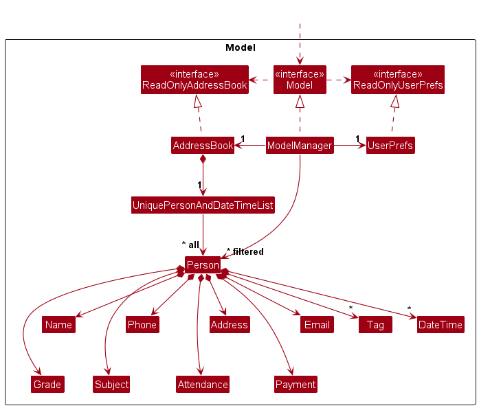

The `Model` component,

* stores the address book data i.e., all `Person` objects (which are contained in a `UniquePersonAndDateTimeList` object).
* stores the currently 'selected' `Person` objects (e.g., results of a search query) as a separate _filtered_ list which is exposed to outsiders as an unmodifiable `ObservableList<Person>` that can be 'observed' e.g. the UI can be bound to this list so that the UI automatically updates when the data in the list change.
* stores a `UserPref` object that represents the user’s preferences. This is exposed to the outside as a `ReadOnlyUserPref` objects.
* stores a `CommandHistory` object that stores the previous commands performed. This is exposed to the outside as a `ReadOnlyCommandHistory` objects.
* does not depend on any of the other three components (as the `Model` represents data entities of the domain, they should make sense on their own without depending on other components)

:information_source: **Note:** An alternative (arguably, a more OOP) model is given below. It has a `Tag` list in the `AddressBook`, which `Person` references. This allows `AddressBook` to only require one `Tag` object per unique tag, instead of each `Person` needing their own `Tag` objects. 

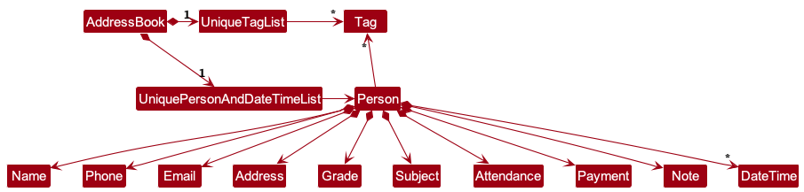

### Storage component

**API** : [`Storage.java`](https://github.com/se-edu/addressbook-level3/tree/master/src/main/java/seedu/address/storage/Storage.java)

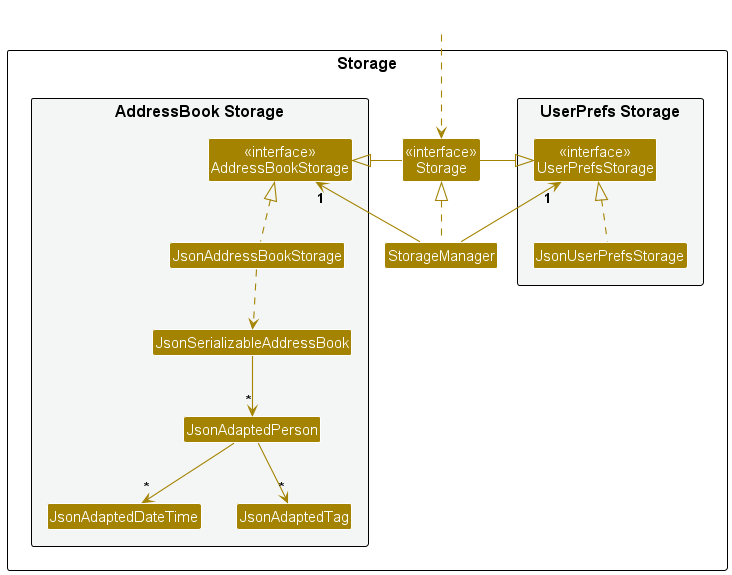

The `Storage` component,
* can save both address book data and user preference data in JSON format, and read them back into corresponding objects.
* inherits from both `AddressBookStorage` and `UserPrefStorage`, which means it can be treated as either one (if only the functionality of only one is needed).
* depends on some classes in the `Model` component (because the `Storage` component's job is to save/retrieve objects that belong to the `Model`)

### Common classes

Classes used by multiple components are in the `seedu.addressbook.commons` package.

--------------------------------------------------------------------------------------------------------------------

## **Implementation**

This section describes some noteworthy details on how certain features are implemented.

### Filter Command

#### Implementation

The Address book filter is made with `GradeSubjectFilterPredicate`. It extends from `Predicate` functional interface and is used to set as a condition to check that for each student, the `Grade` and `Subject` specified is met. Predicates created can be updated using the method `Model#updateFilteredPersonList(predicate)`.

The `Grade` and `Subject` classes are set as additional data fields in `Person`.

* Both classes have exposed methods `isEmpty()`, to check if the grade and subject parameters are specified.
* When unspecified:
  * `Grade()` equals to `Grade("-")` (i.e. "-" will be shown when there is no grade for the student.)
  * `Subject()` equals to `Subject("No subject")` (i.e. "No subject" will be shown when no subject is assigned for the student.)

Given below is an example usage scenario and what the predicate is at each step.

Step 1. The user launches the application for the first time. The student's contacts in a form of `FilteredList` will be shown, where the predicate states that condition is true for all.

:information_source: **Note:** By default, `FilteredList` predicate is set to `FilteredList.ALWAYS_TRUE`. But since both are equivalent, `Model.PREDICATE_SHOW_ALL_PERSONS` is used.

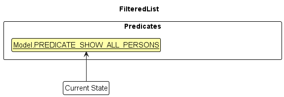

Step 2. The user executes `filter g/A` command to get all students in the `FilteredList` who has an "A" grade. The `filter` command creates `GradeSubjectFilterPredicate`, and calls `Model#updateFilteredPersonList(predicate)`, updating the list to show students that has an "A" grade.

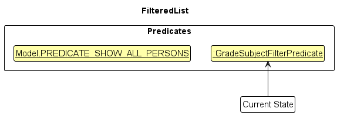

Calling `list` command will revert the predicate back to `Model.PREDICATE_SHOW_ALL_PERSONS`.

 

The following sequence diagram shows how a filter operation goes through the `Logic` component:

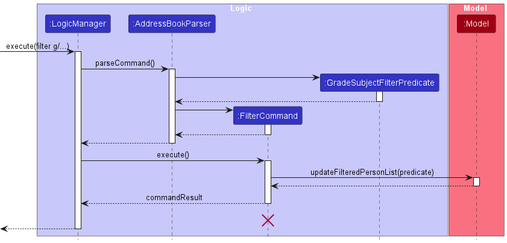

:information_source: **Note:** The lifeline for `FilterCommand` should end at the destroy marker (X) but due to a limitation of PlantUML, the lifeline reaches the end of diagram.

Similarly, how a filter operation goes through the `Model` component is shown below:

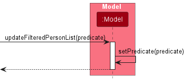

The following activity diagram summarizes what happens when a tutor executes a filter command.

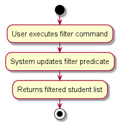

#### Design considerations

* Alternative 1: Filtered address book result can be saved, since in practice, there will only be a few combinations of filters.
  * Pros: Operation will be fast as the number of students increases.
  * Cons: More memory usage.
* Alternative 2 (Implemented): Introduce command history to avoid typing long commands.
  * Pros: Useful for the entire application, and would use less memory compared to alternative 1. (e.g. storing the first 10 commands).
  * Cons: Harder to implement.

### Payment Command

#### Implementation

The payment command in the Address book application is implemented using the PaymentPredicate, which extends the Predicate functional interface.
This predicate is used to set a condition for filtering students based on whether they have paid or not paid.

The application allows updating the payment predicate using the Model#updateFilteredPersonList(predicate) method.

The Payment class is added as an additional data field in the Person class.
* When unspecified:
    * `Payment()` equals to `Payment("-")` (i.e. "-" will be shown when there is no payment for the student.)

Given below is an example usage scenario and what the predicate is at each step.

Step 1. The user launches the application for the first time. The student's contacts in the form of FilteredList will be shown, where the predicate states that the payment condition is true for all.

Step 2. The user executes `Payment pa/paid` command to get all students in the `FilteredList` who has an "Paid". The `payment` command creates `PaymentFilterPredicate`, and calls `Model#updateFilteredPersonList(predicate)`, updating the list to show students that has "Paid".

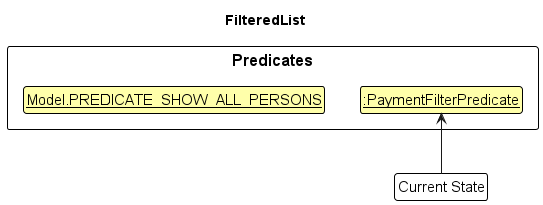

Calling `list` command will revert the predicate back to `Model.PREDICATE_SHOW_ALL_PERSONS`.

 
The following sequence diagram shows how a Payment filter operation goes through the `Logic` component:

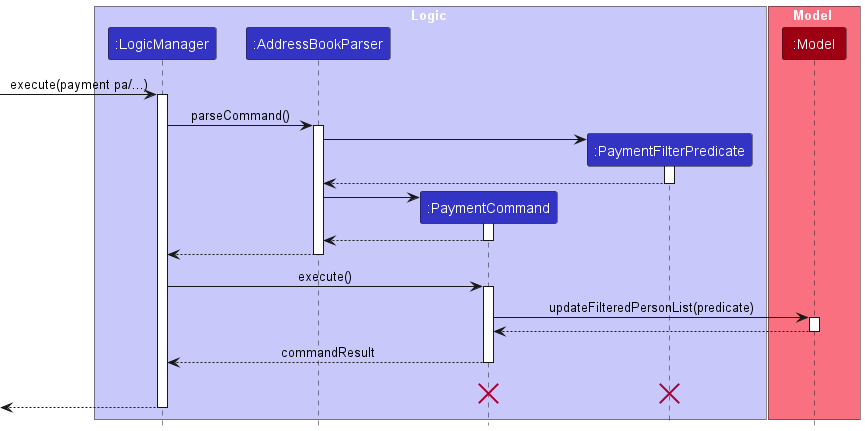

:information_source: **Note:** Similarly to filter command, the lifeline for `PaymentCommand` should end at the destroy marker (X) but due to a limitation of PlantUML, the lifeline reaches the end of diagram.

The following activity diagram summarizes what happens when a tutor executes a filter command.

)

### View Command

#### Implementation

The view commmand in the Address book application is implemented using ViewWindow, where Logic#getFilteredPersonList() retrieves the list of students to be shown in the ViewWindow calendar.

The `DateTime' class is set as additional data fields in `Person` which is used to map the students to their respective calendar dates.

Step 1. The user launches the application for the first time.

Step 2.
- The user executes `view` command to view schedule on a calendar. The view commands calls `MainWindow#handleView()`. The `ViewWindow` will be initialized with the initial `Logic` in MainWindow.
- `ViewWindow#drawCalendar()` executes and it calls on `ViewWindow#createSessionMap(currentFocusedDate)` to create a map of all tutoring sessions that falls on a date in the current focused month.
- `ViewWindow#createSessionsOnDay` is executed on every date in the map of all tutoring session created previously to draw all sessions corresponding to their date in the calendar.

Step 3. User views all sessions according to days in the current focused month.

Step 4. User click on right/left arrow button to view next/previous month, repeat from step 2

The following sequence diagram shows how a view operation goes through the `Logic` component:

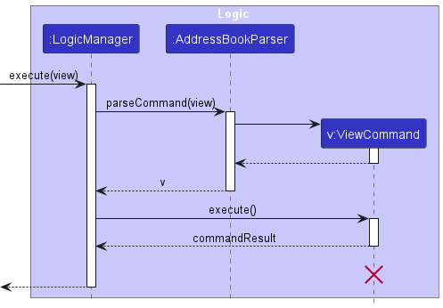

The following sequence diagram shows how a view operation goes through the `UI` component:

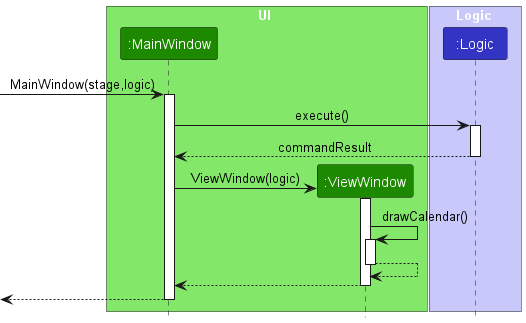

The following activity diagram summarizes what happens when a tutor executes a view command.

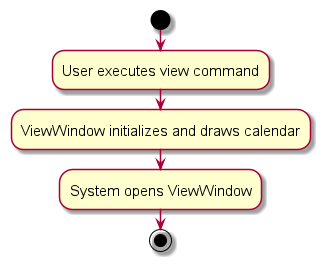

--------------------------------------------------------------------------------------------------------------------

## **Documentation, logging, testing, configuration, dev-ops**

* [Documentation guide](Documentation.md)
* [Testing guide](Testing.md)
* [Logging guide](Logging.md)
* [Configuration guide](Configuration.md)
* [DevOps guide](DevOps.md)

--------------------------------------------------------------------------------------------------------------------

## **Appendix: Requirements**

### Product scope

**Target user profile**:

* Tech-savvy tutors who:
  * has a need to manage a significant number of contacts
  * prefer desktop apps over other types
  * can type fast
  * prefers typing to mouse interactions
  * is reasonably comfortable using CLI apps

**Value proposition**: Allows tutors to view details of students that they are currently teaching, in a simple GUI application that favors CLI experience.

### User stories

Priorities: High (must have) - `* * *`, Medium (nice to have) - `* *`, Low (unlikely to have) - `*`

| Priority | As a …​          | I want to …​                                | So that I can…​                                                         |
|---------|------------------|---------------------------------------------|-------------------------------------------------------------------------|
| `* * *` | new tutor        | see usage instructions                      | refer to instructions when I forget how to use the App                  |
| `* * *` | tutor            | add a new tutor                             | manage the new tutor's schedule                                         |
| `* * *` | tutor            | delete a student                            | remove entries that I no longer need                                    |
| `* * *` | tutor            | find a student by name                      | locate details of students without having to go through the entire list |
| `* * *` | tutor            | add a student                               | register a student for tutoring                                         |
| `* * *` | tutor            | list all students                           | view all registered students                                            |
| `* * *` | tutor            | edit details of a student                   | update whenever their contact details changes                           |
| `* * *` | tutor            | edit my own details                         | update whenever my contact details changes                              |
| `* *`   | tutor            | filter my students by subject / grade level | tailor my teaching approach according to students' needs                |
| `* *`   | tutor            | view all outstanding payments               | remind their parents of their tuition fees                              |
| `* *`   | tutor            | view my schedules                           | get to the appointed lessons on time                                    |
| `*`     | tutor            | track attendence of students                | monitor their commitment to tutoring sessions                           |
| `*`     | tutor            | reschedule sessions with my students        | accomodate changes in availability                                      |
| `*`     | tutor            | make session notes for students             | keep track of lesson details                                            |
| `*`     | tech-savvy tutor | have access to a command history             | so that I can eliminate typing long commands more than once.            |

*{More to be added}*

### Use cases

(For all use cases below, the **System** is the `TutorsGo` and the **Actor** is the `tutor`, unless specified otherwise)

**Use case: Adding a student note**

**MSS**

1. Tutor adds a note for a particular student.
2. TutorsGo shows a success message.

    Use case ends.

**Use case: Filter students**

**MSS**

1. Tutor filters student by grade and/or subject.
2. Tutor shows a success message along with students meeting criteria.

    Use case ends.

**Extensions**

* 1a. Parameters given are invalid.
    
    * 1a1. TutorsGo shows an error message.
    
    Use case ends.

**Use case: Adding a person**

**MSS**

1.  Tutor adds a person
2.  TutorsGo shows a success message.

    Use case ends.

**Extensions**

* 1a. Parameters given are invalid.

    * 1a1. TutorsGo shows an error message.

      Use case ends.

**Use case: Check command history**

**MSS**

1. Tutor checks the command history.
2. TutorsGo shows a command history list.

    Use case ends.

**Extensions**

* 1a. Tutor enters the command he/she wants to run.

    * 1a1. TutorsGo shows output of command.
  
    Use case ends.

**Use case: View schedule**

**MSS**
1.  User requests to view schedule
2.  TutorsGo shows upcoming schedule of current month

    Use case ends.

**Use case: Track payment status**

**MSS**
1.  User requests to list students
2.  TutorsGo shows a list of students
3.  User requests to track stu who not paid in the list
4.  TutorsGo shows all the student Not paid

    Use case ends.

**Extensions**

* 2a. The list is empty.

    Use case ends.

* 3a. The given index is invalid.

    * 3a1. TutorsGo shows an error message.

      Use case resumes at step 2.

*{More to be added}*

### Non-Functional Requirements

1.  Should work on any _mainstream OS_ as long as it has Java `11` or above installed.
2.  Should be able to hold up to 1000 persons without a noticeable sluggishness in performance for typical usage.
3.  A user with above average typing speed for regular English text (i.e. not code, not system admin commands) should be able to accomplish most of the tasks faster using commands than using the mouse.
4.  Should handle errors without crashing
5.  Should be able to function in offline environments
6.  Command names should be clear and well-defined
7.  Error messages should clearly state issues or propose solution
8.  Should be used by a single user
9.  Should still work on CLI if there is no GUI.

*{More to be added}*

### Glossary

* **Mainstream OS**: Windows, Linux, Unix, MacOS
* **CLI**: Command line interface
* **GUI**: Graphical user interface

--------------------------------------------------------------------------------------------------------------------

## **Appendix: Instructions for manual testing**

Given below are instructions to test the app manually.

:information_source: **Note:** These instructions only provide a starting point for testers to work on;
testers are expected to do more *exploratory* testing.

### Launch and shutdown

1. Initial launch

   1. Download the jar file and copy into an empty folder

   1. Double-click the jar file Expected: Shows the GUI with a set of sample contacts. The window size may not be optimum.

1. Saving window preferences

   1. Resize the window to an optimum size. Move the window to a different location. Close the window.

   1. Re-launch the app by double-clicking the jar file. 
       Expected: The most recent window size and location is retained.

1. _{ more test cases …​ }_

### Deleting a person

1. Deleting a person while all persons are being shown

   1. Prerequisites: List all persons using the `list` command. Multiple persons in the list.

   1. Test case: `delete 1` 
      Expected: First contact is deleted from the list. Details of the deleted contact shown in the status message. Timestamp in the status bar is updated.

   1. Test case: `delete 0` 
      Expected: No person is deleted. Error details shown in the status message. Status bar remains the same.

   1. Other incorrect delete commands to try: `delete`, `delete x`, `...` (where x is larger than the list size) 
      Expected: Similar to previous.

1. _{ more test cases …​ }_

### Saving data

1. Dealing with missing/corrupted data files

   1. _{explain how to simulate a missing/corrupted file, and the expected behavior}_

1. _{ more test cases …​ }_
